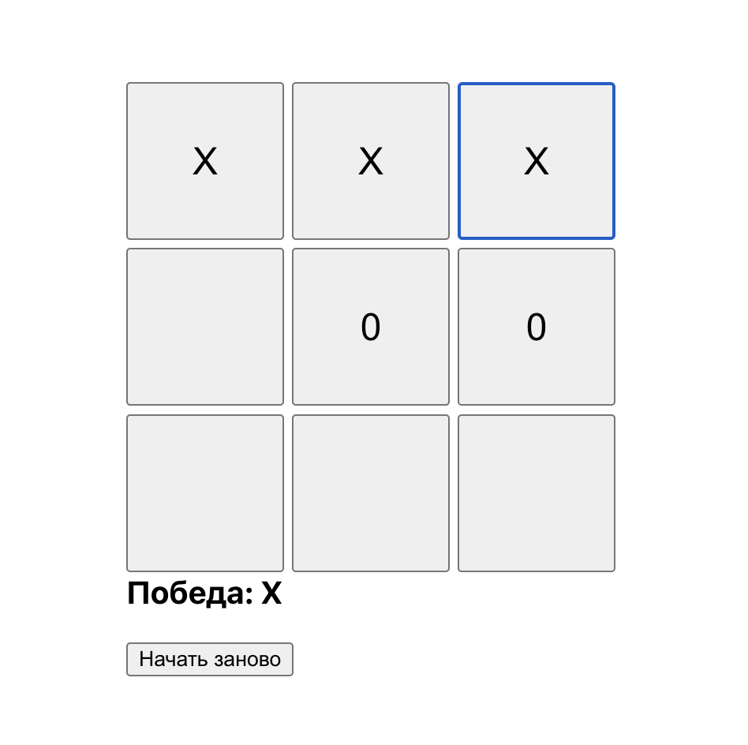
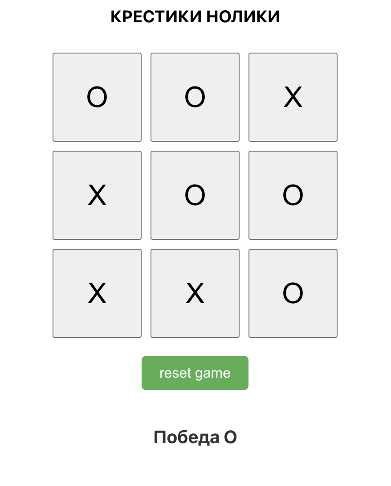
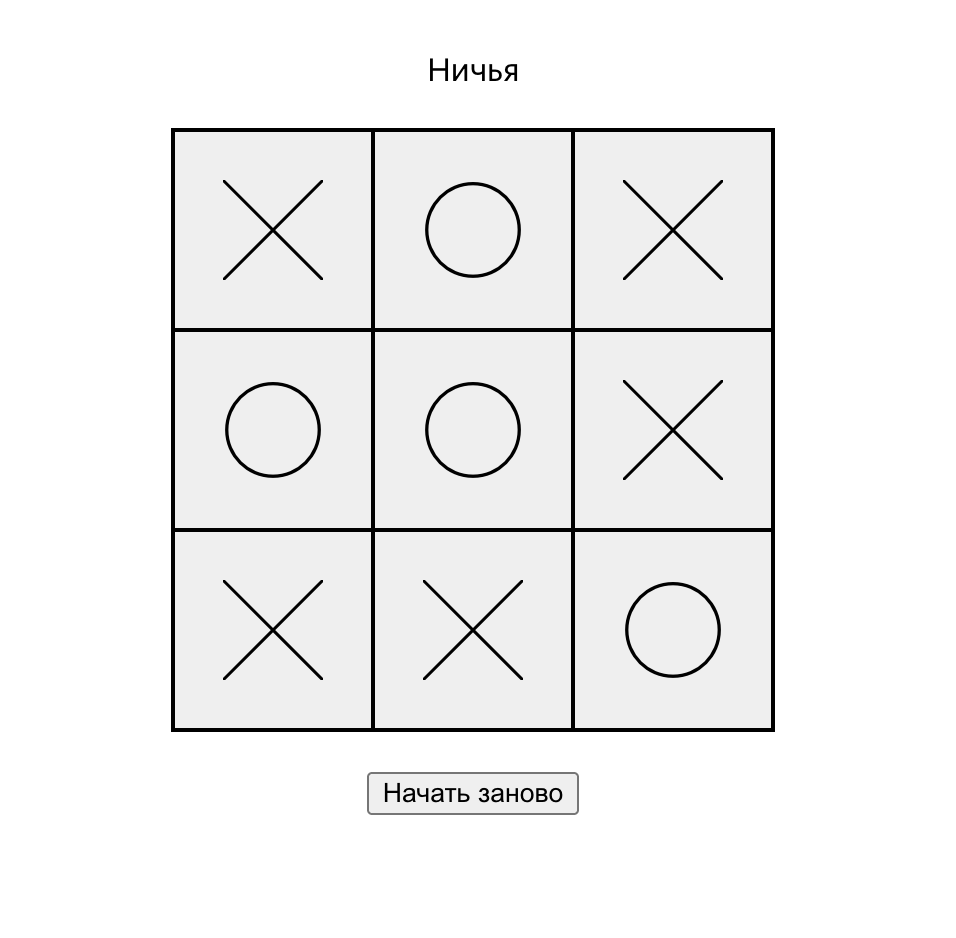

# Tic-Tac-Toe 

This repository contains **three versions** of the classic Tic-Tac-Toe game:  
1. **React only** — basic implementation with local component state.  
2. **React + Redux** — centralized state management using Redux.  
3. **React + Redux + Thunk** — same as version 2 but with `redux-thunk` middleware included.  

---

##  Repository Structure

```
root/
│
├─ my-project-tic-tac-toe/              # Version 1 – React only
│   ├─ src/
│   ├─ package.json
│   └─ ...
│
├─ my-project-tic-tac-toe-redux/        # Version 2 – React + Redux
│   ├─ src/
│   ├─ package.json
│   └─ ...
│
└─ result-school-tic-tac-toe-redux/     # Version 3 – React + Redux + Redux-Thunk
├─ src/
├─ package.json
└─ ...
````
---

## 1️⃣ Tic-Tac-Toe (React)

A simple **Tic-Tac-Toe** game built with **React**.

Play in your browser with a clean and responsive interface.

**Features:**
- Play with a friend on the same device.
- Real-time updates of the game board.
- Shows the current player’s turn.
- Detects winner or draw.

**Technologies:** React 18

**Run:**
```bash
cd my-project-tic-tac-toe
npm install
npm start
````

App: [http://localhost:3000](http://localhost:3000)



---

## 2️⃣ Tic-Tac-Toe (React + Redux)

Same game but using **Redux** to store and update the game state.

**Technologies:** React 18, Redux 5, React-Redux 9

**Run:**

```bash
cd my-project-tic-tac-toe-redux
npm install
npm start
```



---

## 3️⃣ Tic-Tac-Toe (React + Redux + Thunk)

An extended version of the Redux app. Essentially the same as version 2 but already includes **redux-thunk** middleware.

**Features:**

* All features of version 2.

**Technologies:** React 18, Redux 5, React-Redux 9, Redux-Thunk

**Run:**

```bash
cd result-school-tic-tac-toe-redux
npm install
npm start
```



---

##  Notes

* All apps run on port `3000` by default. Change the port if multiple apps are running simultaneously.
* Built with **Create React App** for easy setup.

```
```
