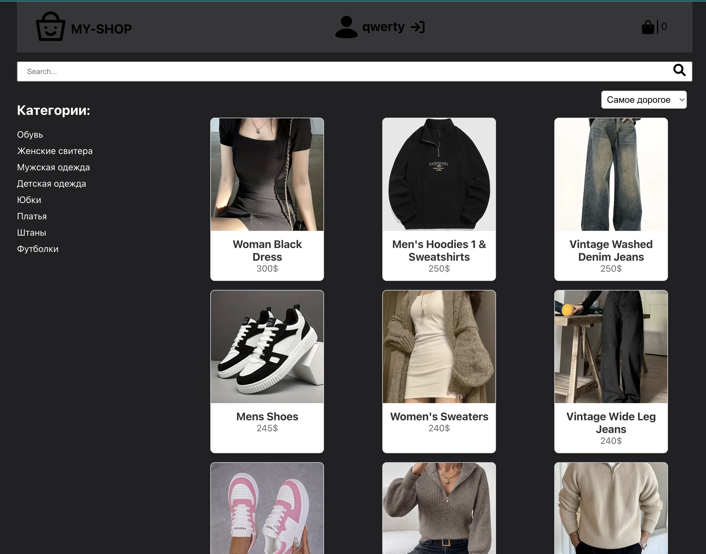

# My Shop – интернет-магазин одежды

Проект состоит из двух частей: **Frontend** на React и **Backend** на Node.js/Express + MongoDB.

```
project/
├── frontend/   # React приложение
└── backend/    # Node.js + Express API
````

---

##  Frontend

**Стек технологий:**
- React 18
- Redux + Redux Thunk
- React Router DOM
- React Hook Form + Yup
- styled-components / CSS Modules
- Font Awesome

**Установка и запуск:**

```
cd frontend
npm install
npm start
````

Приложение будет доступно по адресу: [http://localhost:3000]

**Скрипты:**

* `npm start` – запуск dev-сервера React
* `npm run build` – сборка production-версии




---

## 🛠 Backend

**Стек технологий:**

* Express
* Mongoose (MongoDB)
* JSON Web Token (JWT)
* bcryptjs
* cookie-parser
* cors
* dotenv
* validator

**Установка и запуск:**

```
cd backend
npm install
npm run dev
```

Сервер запустится по адресу: [http://localhost:3002] (или другой порт из `.env`)

**Переменные окружения:**

Создайте файл `.env` в папке `backend`:

```
PORT=3002
MONGO_URI=ваша_строка_подключения_к_mongodb
```

**Скрипты:**

* `npm run dev` – запуск сервера в режиме разработки (nodemon)


Конечно! Вот перевод твоего README на английский:

---

# My Shop – Online Clothing Store

The project consists of two parts: **Frontend** built with React and **Backend** using Node.js/Express + MongoDB.

```
project/
├── frontend/   # React application
└── backend/    # Node.js + Express API
```

---

## Frontend

**Tech Stack:**

* React 18
* Redux + Redux Thunk
* React Router DOM
* React Hook Form + Yup
* styled-components / CSS Modules
* Font Awesome

**Installation and Run:**

```
cd frontend
npm install
npm start
```

The application will be available at: \[http\://localhost:3000]

**Scripts:**

* `npm start` – start the React development server
* `npm run build` – build the production version


---

## 🛠 Backend

**Tech Stack:**

* Express
* Mongoose (MongoDB)
* JSON Web Token (JWT)
* bcryptjs
* cookie-parser
* cors
* dotenv
* validator

**Installation and Run:**

```
cd backend
npm install
npm run dev
```

The server will run at: \[http\://localhost:3002] (or another port set in `.env`)

**Environment Variables:**

Create a `.env` file in the `backend` folder:

```
PORT=3002
MONGO_URI=your_mongodb_connection_string
```

**Scripts:**

* `npm run dev` – start the server in development mode (nodemon)

