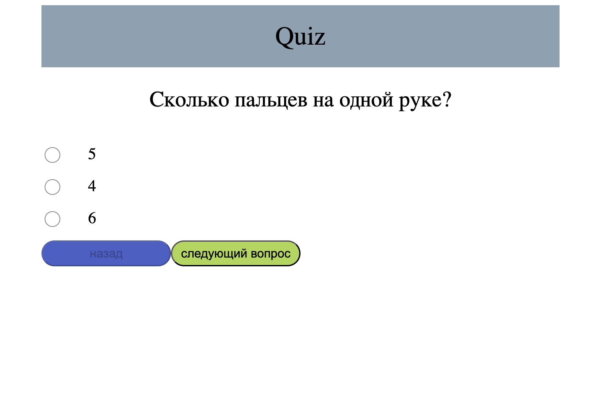

````markdown
# Quiz App 📝

A web application for creating and taking quizzes.  
Backend is built with **Node.js** and **Express**, frontend uses **EJS**, and data is stored in **MongoDB**.

---

## 🚀 Features

- **Create Quizzes** – users can create quizzes with multiple questions.  
- **Take Quizzes** – users can attempt quizzes and see their results.  
- **Results History** – view past attempts and scores.  
- **User-Friendly Interface** – clean and intuitive design.

---

## 💻 Technologies

- **Node.js** – backend runtime environment.  
- **Express.js** – minimalistic web framework for routing and APIs.  
- **EJS** – templating engine for server-side HTML rendering.  
- **MongoDB** – NoSQL database for storing questions, answers, and results.  
- **Mongoose** – ODM for working with MongoDB using JS objects.

---

##  Getting Started

### Requirements

- **Node.js** (>= 18 recommended)  
- **MongoDB** (local instance or cloud, e.g., MongoDB Atlas)

### Installation

1. **Clone the repository**

```bash
git clone <repository_url>
````

2. **Install dependencies**

```bash
npm install
```

3. **Configure environment variables**

Create a `.env` file in the root directory:

```env
MONGODB_URI=your_mongodb_connection_string
PORT=3000

```

4. **Run the application**

```bash
npm start
```

The app will run at: [http://localhost:3000](http://localhost:3000)

---

## Project Structure

```
quiz-app/
│
├─ public/              # Static files (CSS, JS, images)
│   ├─ script.js
│   └─ styles.css
├─ views/               # EJS templates
│   └─ index.ejs
├─ model/               # Database models and schemas
│   ├─ Answers.js
│   └─ Question.js
├─ controllers/         # Logic connecting models and views
│   └─ controller.js
├─ index.js             # Main server entry point
├─ .env                 # Environment variables
├─ .gitignore           # Files/folders to ignore in Git
├─ package.json         # Project configuration and dependencies
├─ package-lock.json    # Exact versions of dependencies
└─ README.md            # Project documentation
```

---


---

##  Notes

* A running MongoDB instance is required.
* By default, the app runs on port `3000`; this can be changed in the server configuration.
* `.env` is used to store the MongoDB connection string securely.





