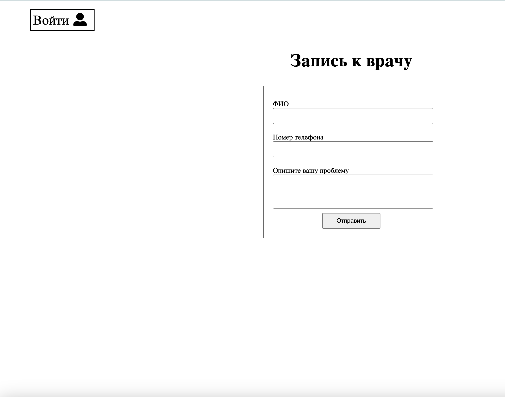
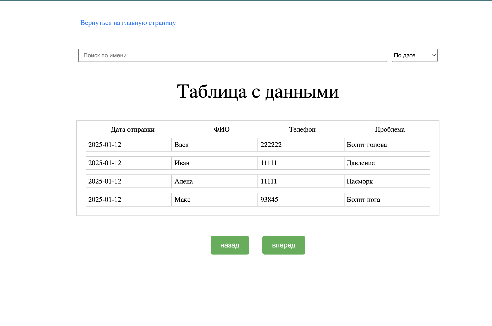

# Doctor Appointment Web Application

A web application for booking doctor appointments, built using **Node.js**, **Express**, and **MongoDB**.
Patients can submit requests, and the administrator can view them through the admin panel.

---

## Running the Project

1. Clone the repository:

```bash
git clone <url>
cd project1
```

2. Install dependencies:

```bash
npm install
```

3. Run the application in development mode:

```bash
npm run dev
```

The application will be available at: [http://localhost:3000](http://localhost:3000)

---

## Technologies Used

* **Backend:** Node.js, Express, Mongoose
* **Database:** MongoDB
* **Templating Engine:** EJS
* **Authentication:** JWT, bcryptjs, cookie-parser

---

## Features

### Patients

* Submit a request via the form on the homepage `/`
* The form requires: `Name`, `Phone number`, `Problem description`

### Administrator

* Login at `/login` using the following credentials:

  * **Email:** [admin@admin.com](mailto:admin@admin.com)
  * **Password:** 1111

* After logging in, access the admin panel `/admin` to view all requests

* Supports pagination, sorting, and search for requests

---

## Project Structure

```
project1/
│
├─ index.js            # Main server file
├─ user.controller.js  # Authorization controller
├─ auth.js             # JWT verification middleware
├─ form.controller.js  # Form handling controller
├─ model/
│   └─ Form.js         # Request data model
├─ views/              # EJS templates
│   ├─ index.ejs       # Homepage with the form
│   ├─ login.ejs       # Login page
│   └─ table.ejs       # Admin panel with requests table
└─ public/             # Static files (CSS, JS)
```

---

## Notes

* MongoDB must be installed to run the application
* JWT secret is stored in `constants.js`:

```js
export const constant = {
  JWT_SECRET: "your-secret-key",
};
```

* Administrator credentials:

  * **Email:** `admin@admin.com`
  * **Password:** `1111`




