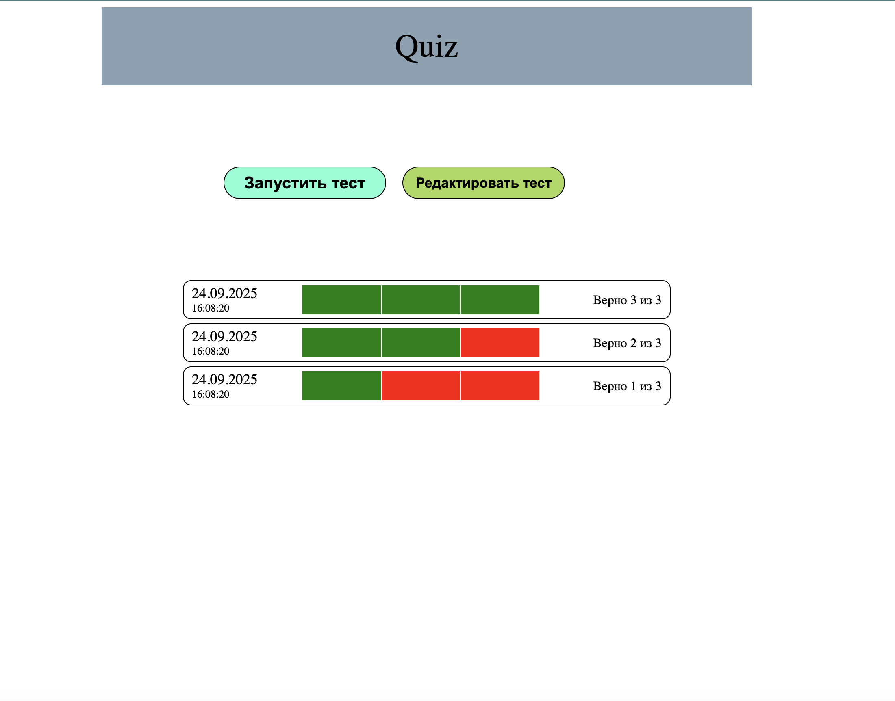

Two simple projects built with **React** and **TypeScript** using **Vite**.
Both projects demonstrate a counter implementation but with different approaches to state management:

* **Counter-v1** – using **Redux Toolkit**
* **Counter-v2** – without Redux, only React + TypeScript

---

## Project Highlights

````
| Project    | Features                                                 |
| ---------- | -------------------------------------------------------- |
| Counter-v1 | - Counter with increment and decrement functionality     |
|            | - Configurable maximum and minimum values                |
|            | - State management via **Redux Toolkit**                 |
|            | - Strong typing with TypeScript                          |
|------------|----------------------------------------------------------|
| Counter-v2 | - Counter with increment and decrement functionality     |
|            | - Configurable maximum and minimum values                |
|            | - State management using React `useState`                |
|            | - Strong typing with TypeScript                          |
````
---

## Installation and Running

Both projects are located in the repository folder.
Navigate to the desired folder and run the commands.

### 1. Clone the repository

```bash
git clone <url>
```

### 2. Run **counter-v1**

```bash
cd counter-v1
npm install
npm run dev
```

The application will be available at: [http://localhost:5173](http://localhost:5173)

### 3. Run **counter-v2**

```bash
cd counter-v2
npm install
npm run dev
```

The application will be available at: [http://localhost:5173](http://localhost:5173) (port may vary)

---

## Technologies Used

### Common for both projects:

* **React** – library for building user interfaces
* **TypeScript** – strong typing
* **Vite** – tool for fast project setup and bundling

### Additionally in **counter-v1**:

* **Redux Toolkit** – modern approach to state management
* **React-Redux** – integration of Redux with React

---

* **counter-v1**




* **counter-v2**


